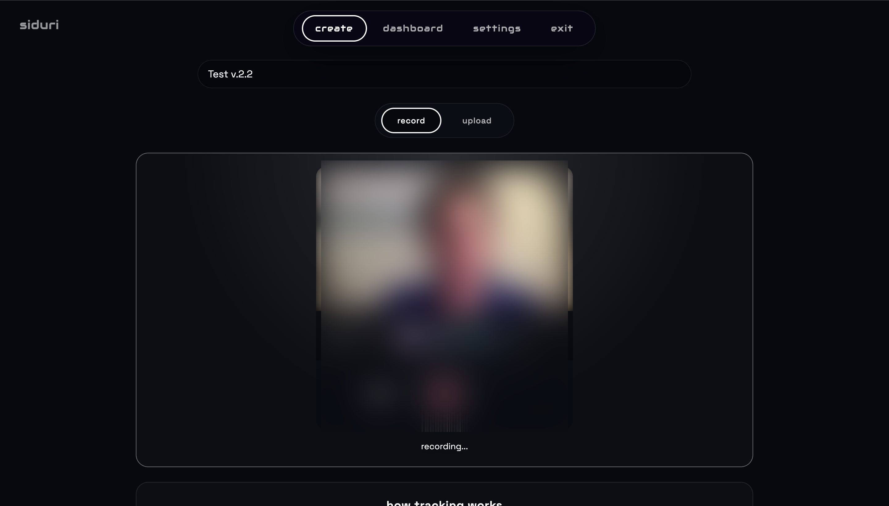
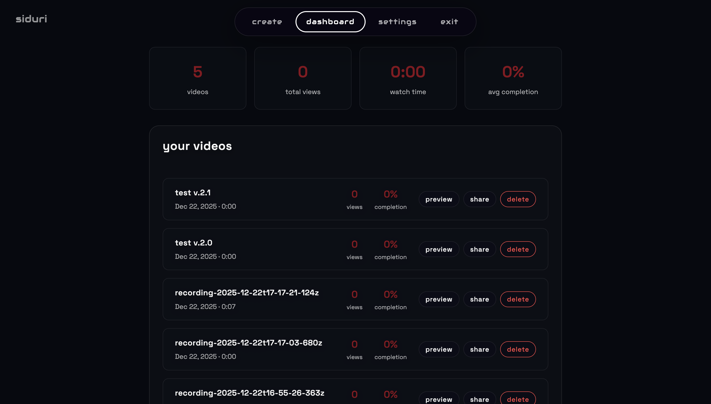

<div align="center">

# Siduri

---

**Self-Hosted Video Hosting with Viewer Analytics**

*A personal alternative to Vidyard and Loom. Record, host, share, and track — all on your own infrastructure.*

[](https://nodejs.org/)
[](https://expressjs.com/)
[](https://www.sqlite.org/)
[](https://cloud.google.com/storage)
[](Dockerfile)

[](LICENSE)
[](CONTRIBUTING.md)

[Features](#features) · [Screenshots](#screenshots) · [Architecture](#architecture) · [Installation](#installation) · [Configuration](#configuration) · [Deployment](#deployment) · [API](#api-endpoints) · [License](#license)

</div>

---

## Features

- **Video Recording** - Record directly in browser with webcam and microphone
- **Background Blur** - Real-time background blur using MediaPipe Selfie Segmentation (light blur or super blur)
- **Custom Backgrounds** - Replace background with images (gradient, office, dark, or custom upload)
- **Video Upload** - Drag-and-drop upload with progress indicator, direct to Google Cloud Storage
- **Automatic Subtitles** - Optional subtitle generation via faster-whisper Cloud Function (Spanish)
- **GIF Thumbnails** - Auto-generated animated GIF previews via Cloud Function
- **Video Playback** - Video.js player with custom branding and subtitle support
- **View Tracking** - Anonymous session-based tracking with watch time and completion percentage
- **Analytics Dashboard** - See all videos, view counts, and per-viewer analytics
- **Notifications** - Email alerts when someone watches your videos
- **Shareable Links** - Generate tracking links with optional viewer identification
- **JWT Authentication** - Secure login with rate limiting
- **Password Reset** - Email-based password recovery flow

---

## Screenshots

| Recording | Dashboard |
|-----------|-----------|
|  |  |

---

## Tech Stack

| Layer | Technology | Purpose |
|-------|------------|---------|
| **Frontend** | Vanilla JavaScript | No build step, fast loading |
| **Frontend** | Video.js | HTML5 video player |
| **Frontend** | MediaPipe | Background blur/replacement |
| **Backend** | Node.js 18+ | Runtime |
| **Backend** | Express.js | Web framework |
| **Backend** | SQLite (better-sqlite3) | Database |
| **Storage** | Google Cloud Storage | Video file storage |
| **Auth** | JWT + bcrypt | Token-based authentication |
| **Notifications** | Nodemailer | Email notifications |
| **Optional** | faster-whisper | Automatic subtitles |

---

## Architecture

```
┌─────────────────────────────────────────────────────────────────┐
│                        Browser (Client)                          │
│  ┌──────────┐  ┌──────────┐  ┌──────────┐  ┌──────────────────┐ │
│  │  Record  │  │  Upload  │  │  Player  │  │    Dashboard     │ │
│  │(MediaPipe│  │ (Direct  │  │(Video.js)│  │   (Analytics)    │ │
│  │  blur)   │  │  to GCS) │  │          │  │                  │ │
│  └────┬─────┘  └────┬─────┘  └────┬─────┘  └────────┬─────────┘ │
└───────┼─────────────┼─────────────┼─────────────────┼───────────┘
        │             │             │                 │
        ▼             ▼             ▼                 ▼
┌─────────────────────────────────────────────────────────────────┐
│                    Express.js Backend (Node.js)                  │
│  ┌────────┐  ┌────────┐  ┌────────┐  ┌────────┐  ┌───────────┐  │
│  │  Auth  │  │ Videos │  │ Upload │  │ Track  │  │  Notify   │  │
│  │ (JWT)  │  │ (CRUD) │  │(Signed │  │(Views) │  │  (Email)  │  │
│  │        │  │        │  │  URLs) │  │        │  │           │  │
│  └────┬───┘  └───┬────┘  └───┬────┘  └───┬────┘  └───────────┘  │
└───────┼──────────┼───────────┼───────────┼──────────────────────┘
        │          │           │           │
        ▼          ▼           ▼           ▼
   ┌─────────┐          ┌─────────────────────────┐
   │ SQLite  │          │   Google Cloud Storage  │
   │         │          │                         │
   │ users   │          │  videos/*.mp4           │
   │ videos  │          │  videos/*.vtt (subs)    │
   │ views   │          │  videos/*.gif (thumb)   │
   └─────────┘          └───────────┬─────────────┘
                                    │ (GCS Event Trigger)
                                    ▼
                        ┌───────────────────────┐
                        │    Cloud Functions    │
                        │  ┌─────────────────┐  │
                        │  │ siduri-subtitles│  │
                        │  │ (faster-whisper)│  │
                        │  ├─────────────────┤  │
                        │  │   siduri-gif    │  │
                        │  │    (ffmpeg)     │  │
                        │  └─────────────────┘  │
                        └───────────────────────┘
```

### Data Flow

1. **Recording**: Browser captures video with MediaPipe blur → uploads directly to GCS via signed URL
2. **Processing**: GCS triggers Cloud Functions → generates subtitles (.vtt) and thumbnails (.gif)
3. **Playback**: Video.js loads video from GCS, auto-loads subtitles if available
4. **Tracking**: Player sends heartbeats to `/api/track` → stores watch time → triggers email notifications

---

## Prerequisites

Before you begin, ensure you have:

1. **Node.js 18 or higher**
   ```bash
   node --version  # Should be v18.x.x or higher
   ```

2. **Google Cloud account** with:
   - A Google Cloud project
   - Cloud Storage bucket for videos
   - Service account with Storage Admin permissions (for local dev) or default compute service account (for Cloud Run)

3. **GCS bucket CORS configured** (required for browser uploads):
   ```bash
   # Create cors.json
   cat > cors.json << 'EOF'
   [
     {
       "origin": ["*"],
       "method": ["GET", "PUT", "POST", "DELETE", "OPTIONS"],
       "responseHeader": ["Content-Type", "Authorization"],
       "maxAgeSeconds": 3600
     }
   ]
   EOF

   # Apply to your bucket
   gsutil cors set cors.json gs://YOUR_BUCKET_NAME
   ```

---

## Installation

### 1. Get the code

Download or clone the repository:

```bash
cd siduri
```

### 2. Install dependencies

```bash
npm install
```

### 3. Create environment file

```bash
cp .env.example .env
```

### 4. Configure environment variables

Edit `.env` with your values. At minimum, you need:

```bash
# Required
JWT_SECRET=your-secret-key-minimum-32-characters-long-random-string
GCS_BUCKET=your-video-bucket-name
GCS_PROJECT_ID=your-gcp-project-id
```

See [Configuration](#configuration) for all available options.

### 5. Set up Google Cloud authentication (local development only)

```bash
# Option A: Use gcloud CLI (recommended for local dev)
gcloud auth application-default login

# Option B: Use service account key file
export GOOGLE_APPLICATION_CREDENTIALS=/path/to/service-account-key.json
```

### 6. Start the server

```bash
# Development (with auto-reload)
npm run dev

# Production
npm start
```

### 7. Open the app

Navigate to `http://localhost:8080`

### 8. Create your account

1. Click "Register" on the login page
2. Enter email and password (minimum 12 characters)
3. **First user** becomes the owner (no invitation needed)
4. Additional users require an invitation code (owner can generate these in the app)

---

## Configuration

### Environment Variables

| Variable | Required | Default | Description |
|----------|----------|---------|-------------|
| `JWT_SECRET` | **Yes** | - | Secret key for JWT signing. Use a random string of 32+ characters. Generate with: `openssl rand -base64 32` |
| `GCS_BUCKET` | **Yes** | - | Google Cloud Storage bucket name for video files |
| `GCS_PROJECT_ID` | **Yes** | - | Google Cloud project ID |
| `PORT` | No | `8080` | Server port |
| `NODE_ENV` | No | `development` | Set to `production` for secure cookies and HTTPS redirects |
| `DATA_DIR` | No | `./data` | Directory for SQLite database file |
| `BASE_URL` | No | Auto-detected | Public URL for share links (e.g., `https://video.example.com`) |
| `ALLOWED_EMAIL_DOMAINS` | No | - | Comma-separated list of allowed email domains for registration (e.g., `company.com,partner.com`). Leave empty to allow all domains |
| `ALLOWED_ORIGINS` | No | localhost | Comma-separated list of allowed CORS origins |

### Email Settings (Optional)

| Variable | Required | Default | Description |
|----------|----------|---------|-------------|
| `SMTP_HOST` | No | - | SMTP server hostname |
| `SMTP_PORT` | No | `587` | SMTP server port |
| `SMTP_USER` | No | - | SMTP username (enables email notifications) |
| `SMTP_PASS` | No | - | SMTP password |
| `SMTP_FROM` | No | `SMTP_USER` | From address for notification emails |

### Example `.env` file

```bash
# === REQUIRED ===
JWT_SECRET=k8s9d7f6g5h4j3k2l1a0s9d8f7g6h5j4
GCS_BUCKET=my-video-storage
GCS_PROJECT_ID=my-gcp-project-123

# === OPTIONAL: Server ===
PORT=8080
NODE_ENV=production
BASE_URL=https://video.mycompany.com

# === OPTIONAL: Access Control ===
ALLOWED_EMAIL_DOMAINS=mycompany.com,partner.com
ALLOWED_ORIGINS=https://video.mycompany.com,https://mycompany.com

# === OPTIONAL: Email ===
SMTP_HOST=smtp.gmail.com
SMTP_PORT=587
SMTP_USER=notifications@mycompany.com
SMTP_PASS=app-specific-password
SMTP_FROM=Video Notifications <notifications@mycompany.com>
```

---

## Development

### Running locally

```bash
# Start with auto-reload on file changes
npm run dev

# Server runs at http://localhost:8080
```

### Project structure

```
siduri/
├── server/
│   ├── index.js           # Express entry point
│   ├── middleware/
│   │   └── jwtAuth.js     # JWT auth middleware
│   ├── routes/
│   │   ├── auth.js        # Login/register/password reset
│   │   ├── upload.js      # GCS signed URL generation
│   │   ├── videos.js      # Video CRUD operations
│   │   ├── track.js       # View tracking endpoint
│   │   ├── share.js       # Share link generation
│   │   ├── settings.js    # Notification settings
│   │   └── health.js      # Health check
│   └── lib/
│       ├── db.js          # SQLite connection
│       ├── email.js       # Password reset emails
│       ├── gcs.js         # GCS client
│       ├── notify.js      # View notifications
│       ├── rateLimit.js   # Rate limiting helpers
│       ├── token.js       # JWT helpers
│       └── validateEnv.js # Environment validation
├── public/
│   ├── index.html         # Upload + Record page
│   ├── watch.html         # Video player page
│   ├── dashboard.html     # Analytics dashboard
│   ├── settings.html      # Notification config
│   ├── forgot-password.html
│   ├── reset-password.html
│   ├── css/
│   │   └── siduri.css     # Theme styles
│   ├── js/
│   │   ├── auth.js        # Auth helpers
│   │   ├── upload.js      # File upload logic
│   │   ├── record.js      # Recording + MediaPipe
│   │   ├── player.js      # Video.js + tracking
│   │   ├── dashboard.js   # Dashboard rendering
│   │   └── settings.js    # Settings page
│   └── img/
│       ├── bg-gradient.svg  # Background option
│       ├── bg-office.svg    # Background option
│       ├── bg-dark.svg      # Background option
│       └── icon_01.svg      # App icon
├── functions/
│   └── video-subtitles/   # Cloud Function for auto-subtitles
├── data/                  # SQLite database (created on first run)
├── Dockerfile
├── package.json
└── README.md
```

### API Endpoints

| Method | Path | Auth | Description |
|--------|------|------|-------------|
| POST | `/api/auth/register` | No | Register new user |
| POST | `/api/auth/login` | No | Login and get JWT |
| POST | `/api/auth/logout` | Yes | Logout and revoke token |
| POST | `/api/auth/forgot-password` | No | Request password reset |
| POST | `/api/auth/reset-password` | No | Reset password with token |
| POST | `/api/upload` | Yes | Get GCS signed upload URL |
| GET | `/api/videos` | Yes | List all videos |
| POST | `/api/videos` | Yes | Create video record |
| PATCH | `/api/videos/:id` | No | Update video metadata (duration) |
| DELETE | `/api/videos/:id` | Yes | Delete video |
| POST | `/api/videos/:id/share` | Yes | Generate share link |
| POST | `/api/track` | No | Record view heartbeat |
| GET | `/api/settings` | Yes | Get notification settings |
| PUT | `/api/settings` | Yes | Update notification settings |
| GET | `/health` | No | Health check |

---

## Deployment

### Google Cloud Run (Recommended)

#### Step 1: Create GCS bucket

```bash
# Create bucket for videos
gsutil mb -l us-central1 gs://YOUR_BUCKET_NAME

# Set CORS policy (required for browser uploads)
cat > cors.json << 'EOF'
[
  {
    "origin": ["*"],
    "method": ["GET", "PUT", "POST", "DELETE", "OPTIONS"],
    "responseHeader": ["Content-Type", "Authorization"],
    "maxAgeSeconds": 3600
  }
]
EOF
gsutil cors set cors.json gs://YOUR_BUCKET_NAME

# Make videos publicly readable (required for playback)
gsutil iam ch allUsers:objectViewer gs://YOUR_BUCKET_NAME
```

#### Step 2: Deploy to Cloud Run

```bash
gcloud run deploy siduri \
  --source . \
  --region us-central1 \
  --allow-unauthenticated \
  --min-instances 1 \
  --memory 512Mi \
  --set-env-vars "JWT_SECRET=YOUR_SECRET,GCS_BUCKET=YOUR_BUCKET,GCS_PROJECT_ID=YOUR_PROJECT,NODE_ENV=production"
```

#### Step 3: (Optional) Persist database with GCS volume

By default, the SQLite database is stored in the container and will be lost on redeploy. For persistence:

```bash
# Create a separate bucket for data
gsutil mb -l us-central1 gs://YOUR_BUCKET_NAME-data

# Update service with GCS FUSE volume mount
gcloud run services update siduri \
  --region us-central1 \
  --add-volume name=data-vol,type=cloud-storage,bucket=YOUR_BUCKET_NAME-data \
  --add-volume-mount volume=data-vol,mount-path=/app/data \
  --max-instances 1 \
  --set-env-vars "DATA_DIR=/app/data"
```

**Important:** Set `--max-instances 1` when using SQLite with GCS volume to prevent database corruption from concurrent writes.

#### Step 4: (Optional) Custom domain

```bash
gcloud run domain-mappings create \
  --service siduri \
  --domain video.yourdomain.com \
  --region us-central1
```

### Docker

```bash
# Build image
docker build -t siduri .

# Run container
docker run -p 8080:8080 \
  -e JWT_SECRET=your-secret-key-32-chars-minimum \
  -e GCS_BUCKET=your-bucket \
  -e GCS_PROJECT_ID=your-project \
  -e NODE_ENV=production \
  -v $(pwd)/data:/app/data \
  siduri
```

---

## Automatic Subtitles (Optional)

Siduri supports automatic subtitle generation using a Cloud Function powered by faster-whisper.

### How it works

1. User uploads video to GCS
2. GCS triggers Cloud Function on `object.finalize` event
3. Cloud Function downloads video, transcribes with faster-whisper
4. WebVTT subtitle file uploaded to GCS (same path as video)
5. Video player automatically loads subtitles when available

### Setup

See `functions/video-subtitles/README.md` for deployment instructions.

### Cost

- faster-whisper is free (open source)
- Cloud Function: ~$0.001-0.002 per 5-minute video
- Processing time: ~1-2 minutes per minute of video

---

## Limitations

- **No transcoding** - Upload web-optimized videos (H.264 MP4 or WebM, recommended max 100MB)
- **No video editing** - Upload and record only, no trimming or effects
- **Single-tenant** - Designed for personal or small team use
- **SQLite** - Not suitable for high-traffic production (consider PostgreSQL for scale)
- **Background blur** - Requires MediaPipe, which needs WebGL support in browser

---

## Security Notes

- JWT tokens stored in httpOnly cookies (secure in production)
- Passwords hashed with bcrypt (12 rounds)
- Rate limiting on auth endpoints (10 attempts per 15 minutes)
- API rate limiting (60 requests per minute)
- CORS configured to specific origins
- Helmet.js for HTTP security headers
- Content Security Policy configured (allows MediaPipe WebAssembly and CDN resources)

---

## Contributing

1. Fork the repository
2. Create your feature branch (`git checkout -b feature/amazing-feature`)
3. Commit your changes (`git commit -m 'Add amazing feature'`)
4. Push to the branch (`git push origin feature/amazing-feature`)
5. Open a Pull Request

---

## License

MIT License - see [LICENSE](LICENSE) file for details.

---

Built by [@JDRV-space](https://github.com/JDRV-space)
