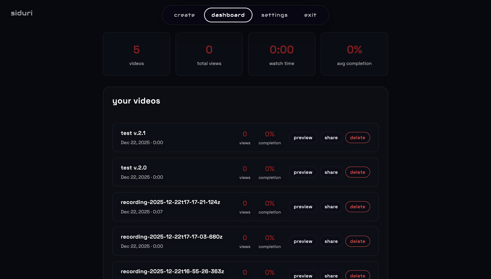
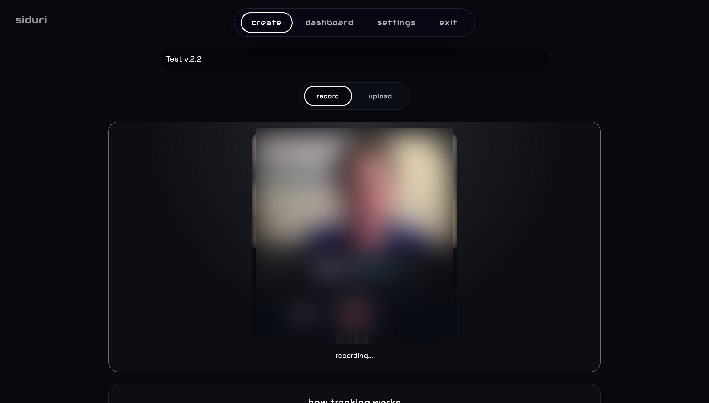

# Siduri

Siduri is a small self-hosted video recording and sharing tool for one installation. It stores video objects in Google Cloud Storage and keeps users, metadata, recipient shares, and viewer analytics in SQLite.

This repository is an initial public source snapshot. It does not yet have a tagged GitHub release or a stable public HTTP API.

## What It Does

- Records webcam and microphone video in the browser or uploads MP4/WebM files.
- Supports MediaPipe background blur and static replacement backgrounds.
- Uploads directly to a private GCS bucket with server-issued signed URLs.
- Creates plain preview links and recipient-specific analytics links.
- Tracks watch progress for valid recipient links and can notify the owner through SMTP or Microsoft Teams.
- Can run optional Cloud Functions for GIF thumbnails and subtitles.
- Deletes the stored video, GIF, subtitle, recipient shares, and analytics when an owner deletes a video.

## Supported Runtime

- Node.js 22 or 24 LTS
- Python 3.11 for optional Cloud Functions
- A private Google Cloud Storage bucket
- A durable local POSIX filesystem for SQLite

The frontend is vanilla JavaScript and has no build step. The server uses Express and `better-sqlite3`.

## Hard Limits

- Siduri is single-tenant. The first account requires `SIDURI_OWNER_SETUP_CODE`; later accounts require invitations.
- Run exactly one application process against a SQLite database. Do not place `siduri.db` on Cloud Storage FUSE or another filesystem without reliable POSIX locking and synchronization.
- Cloud Run container storage is ephemeral. Siduri does not currently have a supported durable Cloud Run deployment because GCS FUSE is not a safe SQLite volume.
- This is not designed for high-traffic public SaaS, multi-tenant isolation, transcoding, editing, or adaptive streaming.
- Uploads are limited to browser-playable MP4/WebM files, 100 MB per video, and 10 upload reservations per user per hour.
- Recipient-specific links expire after 30 days. They record session ID, watch progress, and the recipient email/name supplied by the sender. Analytics are retained for 90 days by default.
- Recipient links can be forwarded. Tokens contain opaque record IDs rather than recipient PII, but anyone holding a valid link can view the associated video until the share expires or the video is deleted.
- Recipient links created before opaque server-side share records were introduced are intentionally invalid and must be recreated.
- The viewer loads Video.js, Google Fonts, the signed GCS media URL, and Siduri's own tracking endpoint. Plain preview links do not create viewer analytics.

## Install

Install the Google Cloud CLI, Node.js 22 or 24, and npm. Then:

```bash
npm ci
cp .env.example .env
```

Set at least:

```bash
JWT_SECRET=use-a-random-string-at-least-32-characters-long
GCS_BUCKET=your-video-bucket
GCS_PROJECT_ID=your-gcp-project-id
SIDURI_OWNER_SETUP_CODE=use-a-random-first-owner-setup-code
```

Authenticate the Google client library and start the application:

```bash
gcloud auth application-default login
npm run dev
```

Open `http://localhost:8080`. A clean database displays the owner-creation form. Enter the value configured in `SIDURI_OWNER_SETUP_CODE`; the created account becomes the installation owner.

## GCS Setup

The idempotent setup script creates or reuses a uniform-access bucket, applies upload CORS, creates a dedicated service account, grants bucket-scoped Object User access, and grants that identity permission to sign URLs:

```bash
./scripts/setup-gcs.sh \
  YOUR_BUCKET_NAME \
  https://video.yourdomain.com \
  YOUR_PROJECT_ID
```

The script prints the service-account flag required by a Google-hosted runtime. Do not grant public object access or project-wide Storage Object Admin.

## Configuration

`.env.example` owns the complete configuration reference. The main settings are:

| Variable | Required | Default | Purpose |
| --- | --- | --- | --- |
| `JWT_SECRET` | Yes | none | Signs authentication and share tokens; minimum 32 characters. |
| `GCS_BUCKET` | Yes | none | Private bucket containing `videos/` objects. |
| `GCS_PROJECT_ID` | Yes | none | Google Cloud project ID. |
| `SIDURI_OWNER_SETUP_CODE` | First owner | none | Authorizes creation of the first account. |
| `BASE_URL` | Production | local URL | Public root or `/video/studio` URL used in reset and share links. |
| `DATA_DIR` | No | `./data` | Durable POSIX directory containing `siduri.db`. |
| `VIEW_DATA_RETENTION_DAYS` | No | `90` | Analytics retention, from 1 to 3650 days. |
| `ALLOWED_ORIGINS` | No | localhost | Comma-separated browser origins allowed by CORS. |
| `SMTP_HOST`, `SMTP_USER`, `SMTP_PASS` | No | none | All three enable password-reset and email notifications. |
| `SMTP_PORT` | No | `587` | Port 465 uses implicit TLS; other ports use STARTTLS behavior. |

## Deployment

### Docker with durable SQLite

Create a named volume so the image's non-root `node` user owns the initialized data directory:

```bash
docker build -t siduri .
docker volume create siduri-data

docker run --name siduri -p 8080:8080 \
  --env-file .env \
  -e GOOGLE_APPLICATION_CREDENTIALS=/var/run/secrets/google/application_default_credentials.json \
  -v /absolute/path/to/application_default_credentials.json:/var/run/secrets/google/application_default_credentials.json:ro \
  -v siduri-data:/app/data \
  siduri
```

Set `NODE_ENV=production` and the externally reachable `BASE_URL` in `.env`. Back up both the SQLite volume and GCS bucket according to the installation's recovery requirements.

### Cloud Run

Cloud Run may be used only for disposable evaluation while Siduri uses SQLite. Restarts, replacements, and deployments can lose the database, and `--max-instances 1` does not make Cloud Storage FUSE a safe SQLite volume.

A supported durable Cloud Run deployment requires a different storage architecture, such as a tested client/server database or a suitable POSIX volume. No production Cloud Run recipe is provided until that contract exists.

## Optional Functions

`functions/gif-generator` creates GIF thumbnails. `functions/video-subtitles` creates VTT subtitles and owns its configuration in its component README. Both functions process only uploads carrying Siduri's signed metadata.

Deploy from the relevant function directory with `GCS_BUCKET` configured. Direct dependencies live in `requirements.in`; `requirements.txt` is the generated Python 3.11 lock:

```bash
uv pip compile --python-version 3.11 --generate-hashes \
  requirements.in --output-file requirements.txt
```

## HTTP API Status

The browser UI uses `/api` and `/video/studio/api`. Integration tokens can authenticate trusted clients, but endpoint compatibility is not yet a stable public contract. Treat route definitions and tests as the current implementation source of truth until a versioned API is released.

## Viewer Data and Security

- Authentication cookies are HTTP-only; production cookies require HTTPS.
- Passwords are hashed with bcrypt. Login and registration are rate limited.
- GCS objects remain private and are read through expiring signed URLs.
- Recipient PII is stored server-side, not embedded in new share tokens.
- The viewer sees an analytics disclosure before playback starts tracking.
- Expired analytics are removed according to `VIEW_DATA_RETENTION_DAYS`; deleting a video immediately removes its analytics and recipient shares.
- Report vulnerabilities according to [SECURITY.md](SECURITY.md). Do not disclose secrets or exploit details in a public issue.

## Screenshots

These screenshots document the initial 2026 public UI and may differ from later releases.





## Contributing and License

See [CONTRIBUTING.md](CONTRIBUTING.md) for validation and change rules.

Siduri is licensed under the Apache License 2.0. See [LICENSE](LICENSE) and [NOTICE](NOTICE).
